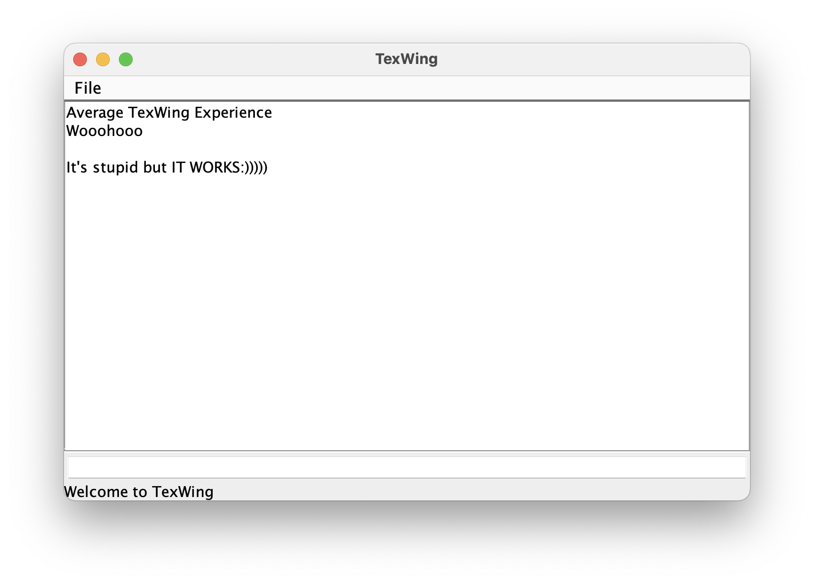
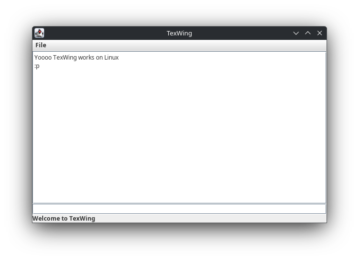

# TexWing
Cross-Platform Text Editor

Not the most optimal thing but a good expriment

## For Now
- [x] Can Create New Files
- [x] Can Open Files
- [x] Can Save Files (done for now but there are some problems)
- [ ] Can "Save as"
- [ ] Can Have Syntax Highlight
- [x] Can Run commands like Emacs ( somehow works but I don't like it:(( )
- [ ] Can Customize theme
- [ ] Can Have Custom Syntax Highlight (made by user)
